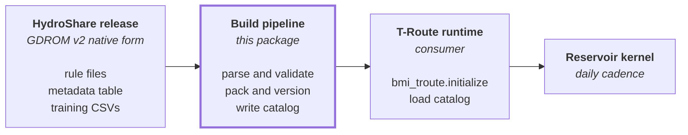

# Design notes

This page collects the context and design decisions behind `nwm-gdrom` in one place. It
is aimed at integrators who need to understand why the catalog looks the way it does,
and at maintainers who need to evolve it.

## What GDROM v2 is

The General Data-driven Reservoir Operation Model (GDROM) version 2 is a publicly
released set of learned daily operating rules for 2,017 regulated reservoirs across the
contiguous United States. The rules are derived from decades of historical inflow,
release, and storage records by the GDROM research team, hosted on HydroShare under DOI
[`10.4211/hs.5293674cb83b4ec698db0eb4777467b8`](https://doi.org/10.4211/hs.5293674cb83b4ec698db0eb4777467b8).
In its native form, the release is a collection of plain-text rule files, an auxiliary
metadata table, and the cleaned daily training time series for the reservoirs that had
enough historical data to be trained locally.

Each reservoir is governed by a small collection of operating *modules* and, for
reservoirs with more than one module, a *dispatcher tree* that selects among them on a
daily basis. A module computes a release as a function of inflow and storage; a
dispatcher selects a module identifier as a function of inflow, storage, the Palmer
Drought Severity Index, and the day of year. The release cadence is daily, matching the
cadence at which the rules were trained.

Reservoirs fall into three categories with materially different data quality:

| Category | Count | Provenance                                                                          |
| -------- | ----- | ----------------------------------------------------------------------------------- |
| Res_R    | 748   | Data-rich; rules trained locally on the reservoir's own historical record.          |
| Res_L    | 174   | Locally fine-tuned through transfer learning on partial historical data.            |
| Res_M    | 1,095 | Rules transferred from the most analogous Res_R reservoir without local validation. |

## Why this package exists

T-Route, the National Water Model's routing engine, runs inside an operational
forecasting system that needs a stable, versioned, machine-readable representation of
these rules: one that loads quickly, occupies a predictable memory footprint, and is
reproducible across retrospective and forecast cycles. The GDROM authors' research-grade
tooling (a text parser and a Python `exec()`-based evaluator) is not suitable for that
environment: it parses rule text at runtime, generates Python functions on the fly,
depends on the cleaned daily CSVs being available on disk, and provides no built-in
versioning.

`nwm-gdrom` closes that gap. It transforms the GDROM v2 release into a single versioned
binary catalog (a NumPy archive with a fixed schema) that T-Route loads once at
initialization through a single function call. The runtime contract is intentionally
narrow: T-Route asks the package to load a catalog and validate its version; the package
returns a structured object whose attributes are the numerical arrays the routing
engine's reservoir kernel needs; nothing else crosses the interface.

## Data flow

The build pipeline is the work this package delivers. Everything upstream is the GDROM
v2 release; everything downstream is the T-Route integration that consumes the catalog
(a separate codebase, not part of this package).

## Reservoir-operation rule semantics

Five distinct release-expression forms appear across the 4,832 module files in the
corpus:

1. Constant release independent of the inputs.
1. Affine in inflow alone.
1. Affine in both inflow and storage.
1. The same affine form wrapped in a maximum-of-zero clamp.
1. An explicit Not-a-Number literal, used by the GDROM authors to flag conditions for
    which they were unable to fit a meaningful rule.

The package unifies all five forms under a single representation:

> `Release = max(a_inflow × Inflow + a_storage × Storage + c, clamp_min)`

Two of the five forms (the multivariate affine and the max-clamped variants) were
observed in the actual corpus but were not enumerated in the originally documented rule
grammar. Both are exercised by reservoirs in the data-poor Res_M category. Folding them
into the unified affine form eliminates the need for a runtime kernel to branch on the
original textual form.

A module is one of two kinds. An `EXPR` module contains a single release expression
valid over the entire input domain. A `TREE` module contains an ordered sequence of
branches, each guarded by a conjunction of one or more atomic predicates of the form
`(variable comparison threshold)`. Branches are evaluated in source order; the first
branch whose predicates all hold supplies the release expression for that day.

A dispatcher follows the same predicate grammar but with two differences: the right-hand
side names a `module_id` rather than a release expression, and the predicate variables
may additionally include PDSI and DOY. A small number of dispatchers in the Res_M subset
contain placeholder branches with empty predicate clauses; these mirror the truthiness
of an empty conditional in the reference simulator and never match. The package
preserves them as inert branches so that the runtime kernel reproduces the reference
behavior exactly.

## Compressed Sparse Row layout

The catalog packs reservoirs, modules, and dispatcher branches in a CSR layout, which is
the standard scheme for sequences-of-sequences with variable lengths. The layout
eliminates pointer indirection, enables vectorized iteration in a tight loop, and
serializes naturally to a small set of flat NumPy arrays. See
[Catalog format](catalog-format.md) for the schema in detail.

## Numerical precision and an empirically driven design correction

The catalog stores all predicate thresholds and release coefficients in 64-bit floating
point. An earlier design specified 32-bit. The decision to upgrade was forced by an
empirically discovered numerical issue: a threshold such as `−2.67`, when round-tripped
through 32-bit floating point, becomes approximately `−2.67000007629...`, while the same
value in 64-bit is `−2.66999...`. The two representations sit on opposite sides of an
exact rule input of `−2.670`, so a predicate of the form `PDSI ≤ −2.67` evaluates to
true at double precision and false at single precision.

One concrete case was found during validation: GRanD identifier 40, day-of-year 213,
storage 238,991 acre-feet, inflow 0.837 acre-feet per day, PDSI exactly `−2.670`. At
single precision the dispatcher sent that day to module 0 with a release of 35.0
acre-feet per day; at double precision it correctly sent the day to module 3 with a
release of 95.8 acre-feet per day. The discrepancy is about 60 acre-feet per day for
that specific configuration, in a direction that affects flood-control decision logic.

Adopting `float64` for the predicate-and-coefficient arrays eliminates the rounding
discrepancy and brings agreement with the reference simulator to bit precision. The cost
is a doubling of the in-memory footprint to about 23.5 MB at full CONUS, which is
negligible against T-Route's overall memory budget.

This finding generalizes: hydrologic decision rules involve a great many threshold
comparisons, and the safety case for any operational integration depends on those
comparisons matching a reference at the bit level. Numerical convention choices that
look harmless in isolation can flip the result of a comparison.

## Out-of-distribution thresholds

The runtime kernel that consumes the catalog is expected to detect inflows that fall
outside the distribution on which a given reservoir's rules were trained, and in that
event to fall back to a physics-based release computation rather than extrapolate from a
learned rule whose validity outside the training envelope is not guaranteed. This is
standard practice for any data-driven model deployed alongside operational physics.

The thresholds for the detector are the 1st and 99th percentiles of the per-reservoir
inflow distribution observed during GDROM training. `nwm-gdrom` computes these at build
time from the cleaned daily training time series shipped with the GDROM v2 release. Both
percentile bounds are configurable through CLI flags.

Reservoirs in the Res_M category, which were not trained on local time series but
inherit their rules from analogous Res_R reservoirs, do not have their own training
data. For them, the OOD trigger defaults to disabled (sentinel values of −∞ and +∞)
until per-reservoir thresholds can be inherited from an analog in a follow-on enrichment
pass.

## Versioning and reproducibility

Two version stamps are embedded in the catalog: `rule_version`, identifying the upstream
GDROM release the catalog was built from, and `crosswalk_version`, identifying the
identifier-resolution table that maps GRanD identifiers to National Hydrofabric lake
identifiers. Both are validated at load time against caller-provided expectations.

The recommended policy is Semantic Versioning for both stamps:

- **MAJOR** for any backward-incompatible change to the on-disk schema.
- **MINOR** for additive changes (new fields with safe defaults).
- **PATCH** for changes to the underlying data without schema changes (corrected rule
    files, refreshed OOD thresholds, regenerated crosswalk).

T-Route's operational restart-file mechanism is expected to record the same stamps and
refuse to resume an operational cycle across mismatched versions; the catalog-side
mismatch error (`CatalogVersionMismatchError`) is the corresponding load-time signal.

For development and ad-hoc workflows, the build pipeline embeds an automatically
generated stamp derived from the source repository's revision identifier when no
explicit version is provided. This default produces a unique stamp for every commit and
is appropriate for development; it should be replaced with an explicit semantic version
for any retrospective or forecast cycle that is published, archived, or used in
operational decision-making.

## Verification

Correctness of the catalog rests on three lines of evidence.

**Parser corpus coverage.** Every rule file in the upstream GDROM v2 corpus parses
cleanly. The full corpus contains 4,832 module files and 1,540 dispatcher files; the
verification suite parses all of them and asserts that no parse errors are raised and
that both module kinds (EXPR and TREE) are represented.

**Bit-exact agreement with the reference simulator.** The GDROM authors' reference
simulator generates Python functions on the fly from the rule text and applies them row
by row to a daily input; the package's evaluator reads the same rules from the binary
catalog and applies them to the same rows. The two are compared at every row, for
representative reservoirs spanning all three GDROM categories and both module kinds. The
comparison runs in two forms: first, against the actual cleaned daily training time
series for reservoirs that have them (Res_R and Res_L); second, against a designed input
grid sampling the inflow, storage, drought-index, and day-of-year domains, used both to
extend agreement testing beyond the historical range and to cover the Res_M category,
which has no training time series. Agreement is required at every row within a tolerance
of one-millionth of an acre-foot per day, which is loose enough to absorb residual
IEEE-754 double-precision rounding noise but tight enough that any logical divergence
between the two implementations would fail the test. The actual measured maximum
disagreement across the test set is about 2 × 10⁻¹³, essentially machine epsilon.

**End-to-end round-trip validation on every build.** Every catalog produced by the CLI
is re-loaded from disk and compared field by field against the in-memory original. All
array fields are compared element-wise with `np.array_equal(equal_nan=True)`; dtype and
shape mismatches are caught; both version stamps must round-trip exactly. Any divergence
aborts the build with a non-zero exit status.

The verification suite runs automatically on every change, on Linux, macOS, and Windows,
across multiple supported Python versions, with coverage tracked.

## T-Route integration

T-Route consumes the catalog through a single call to `load_catalog` at model
initialization. The returned `GDROMCatalog` dataclass exposes the flat NumPy arrays
directly as attributes; T-Route stores them on its model instance and reads them by
reference inside its per-timestep compute loop. No further input/output occurs during
the run.

Two operational invariants are required at the integration boundary:

1. The catalog must be loaded once at startup and held for the duration of the run; it
    is read-only at runtime and imposes no concurrency constraint.
1. The configured rule and crosswalk versions must be validated against the embedded
    stamps at load time, and any mismatch must abort the run rather than continue with
    an unexpected catalog.

The runtime cadence at which the kernel evaluates the rules (daily zero-order-hold with
mass closure through the underlying level-pool physics, per the multi-scale hydrologic
modeling community's prevailing convention) is the responsibility of the routing engine,
not of this package.

The Palmer Drought Severity Index, which the dispatcher trees need as one of their four
inputs, is delivered to T-Route through its existing forcing engine as a standard
monthly forcing variable. The catalog records each reservoir's two-letter state code so
that the runtime kernel can map the per-state PDSI series to the appropriate reservoir
at evaluation time.

## Deferred work

### Identifier crosswalk

GDROM keys its reservoirs on the GRanD identifier; T-Route consumes its lake identifiers
as `nhf_lake_id` from the National Hydrofabric. The bridge between the two namespaces is
the NHDPlusV2 NHDWaterbody Common Identifier (COMID).

A two-stage matching algorithm has been designed but the crosswalk module itself is not
yet implemented. The first stage is a deterministic join through the U.S. Geological
Survey's [ISTARF crosswalk](https://doi.org/10.5066/P9PHECFB), expected to resolve about
1,448 of the 2,017 reservoirs directly. The second stage is an adaptive-radius spatial
fallback for the remaining 569 reservoirs, scoring candidates by distance,
storage-volume agreement (bias-corrected by an empirically measured ratio between GDROM
full-pool storage and NHF active-volume conventions), and state-of-residence agreement.

The catalog already reserves the `crosswalk_version` slot and validates it at load time,
so once the crosswalk artifact is produced and pinned, the catalog rebuild simply
records the stamp and downstream consumers validate against it.

### Res_M OOD threshold enrichment

The GDROM training process records, for each Res_M reservoir, the most analogous Res_R
reservoir from which its rules were copied. The OOD thresholds of that analog are an
immediate, principled default for the Res_M reservoir's own thresholds. The catalog
format already accommodates per-reservoir thresholds; only the build-time enrichment
step is missing.

### Source DOI version stamp

A third version-stamp slot, recording the exact upstream GDROM release DOI a given
catalog was built from, would eliminate one source of provenance ambiguity for
downstream consumers of archived retrospective runs. The change is additive (a new
optional field with a safe default) and backward-compatible.

## Acronyms used throughout

| Acronym   | Meaning                                                                                          |
| --------- | ------------------------------------------------------------------------------------------------ |
| AnA       | Analysis and Assimilation, an NWM forecast configuration.                                        |
| BMI       | Basic Model Interface; the standardized interface T-Route components use.                        |
| CART      | Classification and Regression Tree.                                                              |
| COMID     | Common Identifier, the integer identifier used in NHDPlusV2.                                     |
| CONUS     | Contiguous United States.                                                                        |
| CSR       | Compressed Sparse Row.                                                                           |
| DOY       | Day of year.                                                                                     |
| ETL       | Extract, Transform, Load.                                                                        |
| GDROM     | General Data-driven Reservoir Operation Model.                                                   |
| GRanD     | Global Reservoir and Dam database.                                                               |
| ISTARF    | Inferred Storage and Release From Inflow, a USGS data release with the GRanD-to-COMID crosswalk. |
| NHDPlusV2 | National Hydrography Dataset Plus, version 2.                                                    |
| NHF       | National Hydrofabric.                                                                            |
| NWM       | National Water Model.                                                                            |
| OOD       | Out-of-distribution.                                                                             |
| PDSI      | Palmer Drought Severity Index.                                                                   |
| RFC       | River Forecast Center, a NOAA designation.                                                       |
| T-Route   | The National Water Model's routing engine.                                                       |
| USACE     | United States Army Corps of Engineers.                                                           |
| USGS      | United States Geological Survey.                                                                 |
| WCOSS     | Weather and Climate Operational Supercomputing System (NOAA).                                    |
| ZOH       | Zero-Order Hold.                                                                                 |
