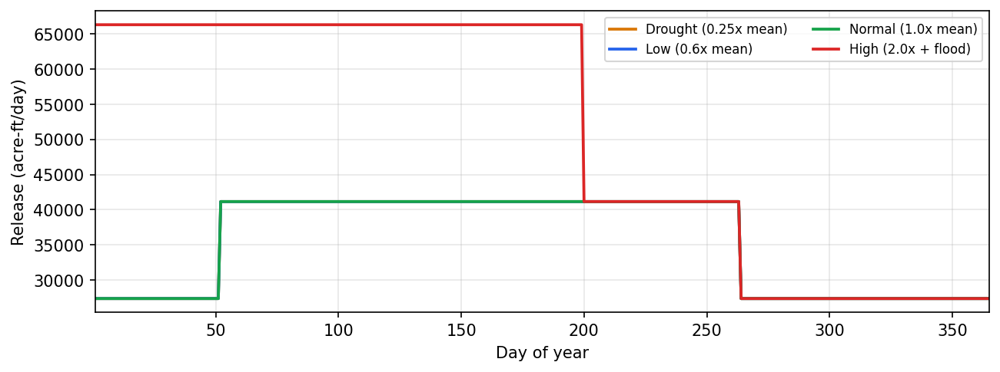

# Examples

Hands-on notebooks that drive the public `nwm-gdrom` API on the real GDROM v2 corpus.
Each notebook is paired between a `py:percent` source and an executed `.ipynb` via
[jupytext](https://jupytext.readthedocs.io/); both files are tracked in the repository
so the rendered docs always show the latest output. To run a notebook locally, build the
catalog first (see the [quickstart](../quickstart.md)) and then open the `.ipynb` from
`docs/examples/` in Jupyter.

## Notebooks

- [{ loading=lazy }](release_response.ipynb "Release response to inflow")

    **Release response to inflow**

    Force a single GDROM reservoir (Hoover Dam, Lake Mead) with four synthetic inflow
    scenarios at increasing intensities, then plot the resulting daily release on a
    common axis. The plot shows the GDROM rule structure as a series of discrete
    plateaus rather than a smooth monotonic response, with transitions driven by the
    dispatcher's seasonal and inflow thresholds.

